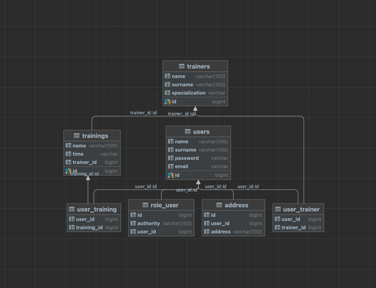

# Образовательный Java-проект

## Описание

Этот проект является учебным примером Java-приложения.
Он представляет собой простое RESTful приложение, реализованное на Java с использованием Spring,
демонстрирующее CRUD операции для сущности `User`.
В проекте реализованы ролевая модель с различными уровнями доступа (Admin, User), регистрация и логин пользователя, а также применены механизмы шифрования паролей и авторизации через JWT-токены.
Приложение основано на фитнес системе позволяющей получить пользователя и его тренеров и тренировки, а так же адреса пользователя

## Технологический стек

- **Spring Framework**: WebMVC, Context, Security, ORM
- **Liquibase**: для управления версиями базы данных
- **PostgreSQL**: основная система управления базой данных
- **Hibernate**: ORM-библиотека для работы с базой данных
- **H2Database**: в памяти база данных для тестирования
- **JUnit**: фреймворк для модульного тестирования
- **Mockito**: для мокирования зависимостей при тестировании
- **Spring Security Test**: для тестирования компонентов безопасности

## Функциональные требования

- Использование **Docker Compose** для оркестрации контейнеров
- Развертывание приложения на сервере приложений **Tomcat**
- Реализация ролевой модели с уровнями доступа Admin и User
- Предоставление функционала регистрации и логина для пользователя
- Использование **JWT-токенов** для авторизации
- Шифрование паролей перед сохранением в базу данных
- Реализация отношений базы данных Один ко Многим, Многие ко Многим и Один к Одному

## Схема таблиц

## Примеры вызовов

Приложение позволяет зарегистрироваться вызвав (Пример для получения токена нового пользователя):

    curl -X POST --location "http://localhost:8080/my-study/api/security/register" \
    -H "Content-Type: application/json" \
    -d "{
    \"userName\": \"Irina\",
    \"userEmail\": \"test@mail.ru\",
    \"password\": \"123_5\"
    }"

После чего можно залогиниться и получить JWT-токен
(пример для получения токена Админа):

    curl -X POST --location "http://localhost:8080/my-study/api/security/login" \
    -H "Content-Type: application/json" \
    -d "{
    \"username\": \"1\",
    \"password\": \"123_1\"
    }"

Дальше вызывать остальные сервисы приложения передав в header
Authorization : Bearer Ваш_токен

## Разработчик
Богатырь Ирина Евгеньевна
